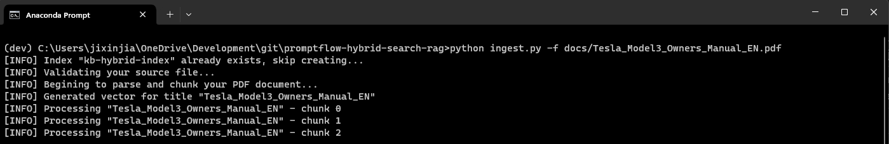
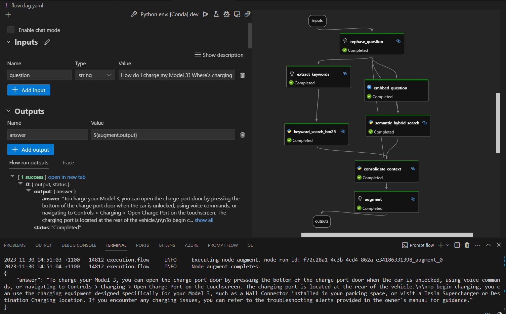
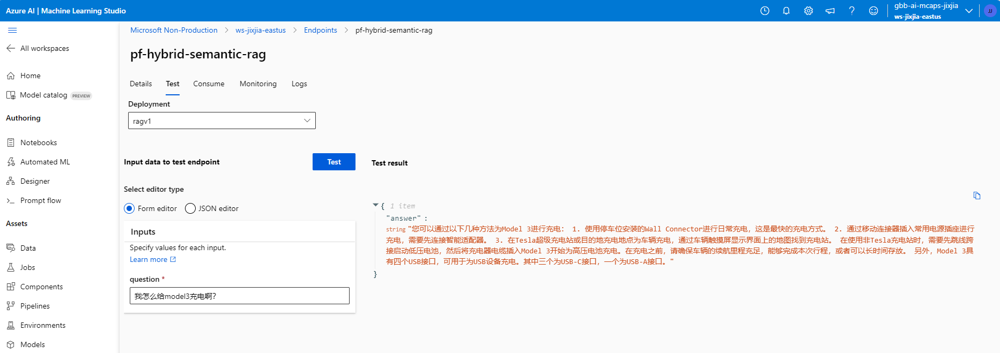

# Best-in-class RAG with PromptFlow and Azure AI Hybrid Search

This repo demonstrates building a generic RAG pattern with PromptFlow and Azure AI Hybrid Search

### Why PromptFlow ?

* To simplify development of complex LLM app workflow
* To systemtically evaluate and quantify LLM quality
* To simplify operationalizing LLM app as a docker on  managed endpoints

### Why Hybrid Search ?

* Azue AI Search makes it possible to combine the best of **Keyword search (BM25)**, **Semantic Search** and **Vectorized Search** for an improved RAG performance (see [benchamrking](https://techcommunity.microsoft.com/t5/ai-azure-ai-services-blog/azure-cognitive-search-outperforming-vector-search-with-hybrid/ba-p/3929167))

##  Instruction

1. Open `.env.template` file and configure following Azure service's connection details.

    |Key|Value|
    |---|---|
    |AZURE_SEARCH_SERVICE_NAME|Azure AI Search service name (e.g. jixjia-search-dev)|
    |SEARCH_ENDPOINT|Azure AI Search service endpoint url (e.g. https://YOUR_SEARCH_SERVICE.search.windows.net)|
    |SEARCH_API_KEY|Azure AI Search management key|
    |AOAI_KEY|Azure OpenAI service API key|
    |AOAI_ENDPOINT|Azure OpenAI service endpoint url (e.g. https://YOUR_AOAI.openai.azure.com/)|

2. Rename `.env.template` to `.env`

3. Run `ingest.py` to add your PDF source to Azure Search index. This tool will perform parsing, chunking and batch indexation of the PDF document for you.    
    
    e.g.   
    `python ingest.py -f PATH_TO_PDF_FILE`

    

4. Run `flow.dag.yaml` to edit the RAG LLM App workflow where necessary.    
I recommend you to install the [PromptFlow VS Code Extension](https://marketplace.visualstudio.com/items?itemName=prompt-flow.prompt-flow) for best local dev  experience.

    

5. Deploy the LLM App to Azure ML Management Endpoint

    